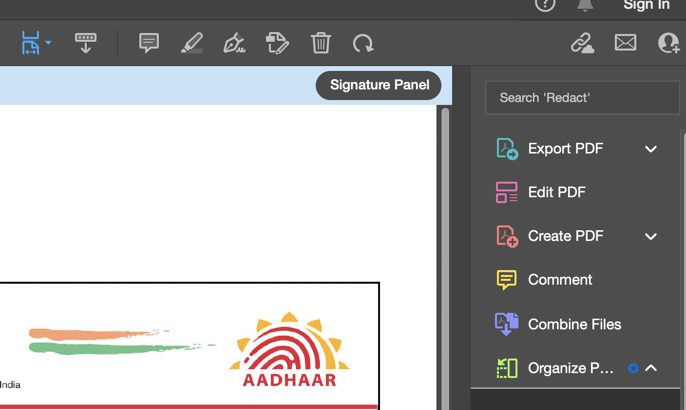
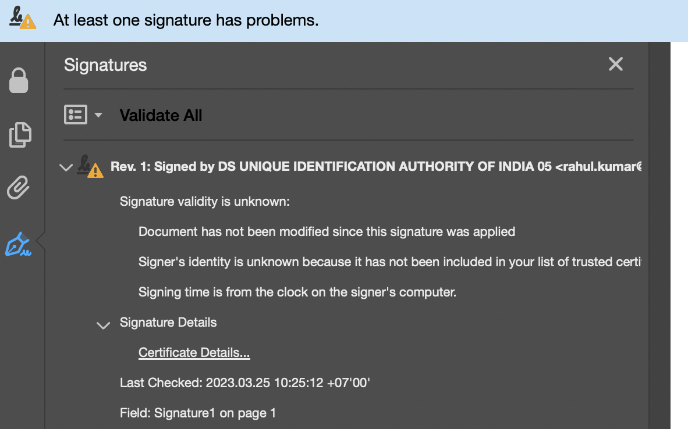
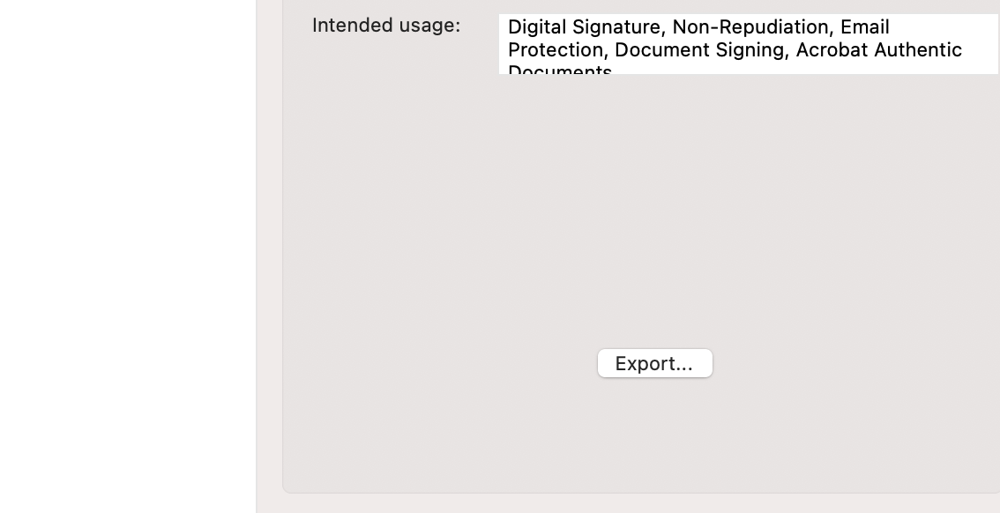
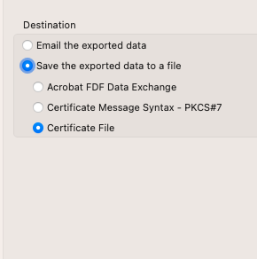

### Usage

For using the app, you will need your adhaar card in a pdf format, downloaded from an official government portal. You will also need to extract a certificate file (`.cer`), following those simple steps on Adobe Acrobat Reader:

1. Open the signature panel:

   
    

2. Browse the certificate details

   
    

3. Click on the export button

   
    

4. Save the file as a `Certificate File`

   
    

You should now be able to use the app accordingly.